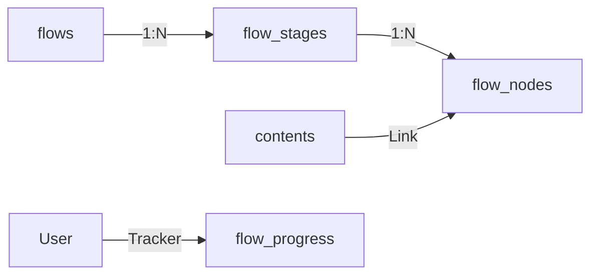

# 플로우(Flow) 기능 기획서: 3단 위계 로드맵

## 1. 기획 배경 및 목적
- **기존 문제**: 단순 나열식 '재생목록'은 순서의 당위성과 학습/감상 맥락을 전달하지 못함.
- **개선 목표**:
    - 단순 리스트가 아닌 **"따라가면 성장하는 로드맵"** 경험 제공.
    - **3단 위계 구조 (Flow > Stage > Node)** 도입으로 체계적인 커리큘럼 구성.
    - 예: [초급] → [중급] → [고급] 순차적 진행 또는 테마별 묶음.

## 2. 핵심 구조: 3단 위계 (Hierarchy)

시스템은 `Root(Flow)` > `Group(Stage)` > `Item(Node)`의 3단 구조를 가집니다.

### Level 1: 플로우 (Flow)
- **정의**: 하나의 완결된 로드맵 (커리큘럼).
- **정보**:
    - 제목, 마스터 설명, 대표 이미지(커버).
    - 전체 테마 컬러, 예상 소요 시간, 전체 난이도.
    - **is_public**: 공개 여부 설정.
- **UX**: 사용자가 처음 마주하는 '책 표지' 역할.

### Level 2: 스테이지 (Stage)
- **정의**: 플로우 내부를 구분하는 중간 단계 (챕터/난이도).
- **예시**:
    - `[Stage 1] 입문: 기초 다지기`
    - `[Stage 2] 심화: 감독의 철학 이해하기`
    - `[Stage 3] 마스터: 오마주 작품 찾아보기`
- **기능**:
    - **배지(Badge)**: 해당 스테이지 완료 시 획득할 수 있는 칭호/아이콘.
    - **잠금(Lock)**: (선택사항) 이전 스테이지 클리어 전까지 잠금 처리 가능.
    - **테마 컬러**: 스테이지별 분위기 전환 가능.

### Level 3: 노드 (Node)
- **정의**: 실제 소비하게 될 개별 콘텐츠 단위.
- **유형**: 책, 영화, 음악, 게임 등 플랫폼 내 모든 `contents`.
- **기능**:
    - **큐레이터 코멘트(Description)**: 왜 이 콘텐츠를 이 순서에 봐야 하는지 가이드.
    - **보너스 콘텐츠**: 해당 노드와 연관된 추가 자료 링크.
    - **필수/선택**: 건너뛰기 가능 여부 설정 (`is_optional`).

---

## 3. 데이터 모델링 (Supabase Schema 반영)

현재 구축된 DB 스키마가 요구사항을 완벽하게 지원합니다.

### 3.1 ERD 요약

### 3.2 테이블 명세

#### 1) flows (플로우 마스터)
| 필드명 | 설명 | 비고 |
|---|---|---|
| id | UUID | PK |
| user_id | UUID | 생성자 (큐레이터) - `profiles.id` FK |
| name | 제목 | |
| description | 전체 설명 | |
| cover_url | 대표 이미지 URL | |
| theme_colors | JSONB | `{primary, secondary}` (전체 테마 색상) |
| difficulty | INT (1-5) | 전체 난이도 |
| estimated_duration | INT | 예상 소요 시간 (분 단위) |
| is_public | Boolean | 공개 여부 |

#### 2) flow_stages (스테이지 / 그룹)
| 필드명 | 설명 | 비고 |
|---|---|---|
| id | UUID | PK |
| flow_id | UUID | FK (flows.id) |
| name | 스테이지명 | 예: "Part 1. 시작하기" |
| description | 스테이지 설명 | |
| sort_order | INT | 정렬 순서 |
| badge_title | 칭호 | 완료 시 부여될 배지 이름 |
| badge_icon | 아이콘 URL | 완료 시 부여될 배지 아이콘 |
| theme_color | HEX | 스테이지 전용 테마색 (Overridable) |

#### 3) flow_nodes (노드 / 아이템)
| 필드명 | 설명 | 비고 |
|---|---|---|
| id | UUID | PK |
| flow_id | UUID | FK (flows.id) |
| stage_id | UUID | FK (flow_stages.id) - *Nullable이지만 3단 구조에선 필수 권장* |
| content_id | Text (contents.id) | FK (contents.id) |
| description | 코멘트 | 큐레이터의 가이드 |
| sort_order | INT | 스테이지 내 순서 |
| difficulty | INT (1-5) | 노드별 난이도 |
| is_optional | Boolean | 건너뛰기 가능 여부 |
| bonus_content_ids | JSONB | `[]` (추가 콘텐츠 ID 배열) |

#### 4) flow_progress (진행 상황)
| 필드명 | 설명 | 비고 |
|---|---|---|
| id | UUID | PK |
| user_id | UUID | FK |
| flow_id | UUID | FK |
| current_stage_id | UUID | FK |
| current_node_index | INT | 현재 진행 중인 노드 위치 |
| completed_stages | JSONB | `[]` (완료된 스테이지 ID 목록) |

---

## 4. 사용자 경험 (UX) 시나리오

1.  **탐색 (Discovery)**
    *   사용자는 '플로우' 탭에서 다른 유저나 셀럽이 만든 로드맵을 발견합니다.
    *   클릭하면 Flow의 전체 구조(로드맵)가 펼쳐집니다.

2.  **구조 파악 (Overview)**
    *   전체 스테이지가 아코디언 형태로 나열됩니다.
    *   `[Stage 1] 입문` (열림) - 노드 리스트 노출
    *   `[Stage 2] 심화` (닫힘/잠금)
    *   `[Stage 3] 마스터` (닫힘/잠금)

3.  **진행 (Progress)**
    *   첫 번째 노드(콘텐츠)를 클릭하여 상세 페이지로 이동하거나 인앱 뷰어에서 감상합니다.
    *   완료 후, 큐레이터가 남긴 "다음 단계로 가기 전 생각할 점" 코멘트를 확인합니다.
    *   오른쪽 화살표(Next)를 눌러 다음 노드로 이동합니다.

4.  **달성 및 보상 (Achievement)**
    *   `Stage 1`의 모든 필수 노드 완료 시 **"입문자 배지" 획득** 알림.
    *   다음 스테이지 `Stage 2`가 잠금 해제되며 진행 가능 상태로 변경됨.

## 5. 개발 우선순위 및 폐기 항목

### 폐기 대상
- **구 재생목록(Playlist) 기능 및 UI**: 
    - 단순 리스트 형태의 UI 제거.
    - 기존 데이터 마이그레이션이 필요하다면 `Stage 1(기본)` 하나를 생성하여 모두 몰아넣는 방식 고려 (데이터 폐기 가능하므로 생략 가능).

### 구현 우선순위
1.  **에디터 (Creator Tools)**:
    - Flow 생성 -> Stage 추가 -> Node 추가(검색 및 드래그) 3단계 위자드.
    - Stage 순서 변경 및 Node 이동 기능.
2.  **뷰어 (Consumer Viewer)**:
    - 스테이지별 진행률(Progress Bar) 표시.
    - 잠금된 스테이지 시각적 처리(자물쇠 아이콘 등).
3.  **마이페이지 (Progress Tracker)**:
    - 내가 진행 중인 Flow 목록.
    - 획득한 Stage 배지 모음.